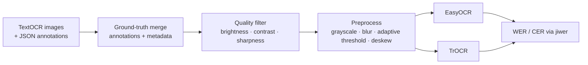

<div align="center">

# 📸 A Picture Is Worth a Thousand Words: OCR Pipeline

**Scene-text extraction on TextOCR, with image-quality filtering, OpenCV preprocessing, and a head-to-head comparison of EasyOCR and Microsoft TrOCR.**


[](https://youtu.be/Em239t2VNRY)

</div>

## Overview
Huge amounts of useful text sit locked inside photos: signs, labels, book covers, whiteboards. This project builds an OCR pipeline for messy, real-world images, where text can be curved, rotated, low-contrast, or cluttered. It then compares a lightweight detector-recognizer (**EasyOCR**) with a transformer encoder-decoder (**TrOCR**, `microsoft/trocr-base-printed`). Use cases include document digitization, automated data entry, and accessibility tools.

## Key results
Both models were evaluated on **2,000 OCR-ready images** using `jiwer` (`final/Model_EasyOCR-and-TrOCR_Complete.ipynb`). Lower is better.

| Model | Avg. WER | Avg. CER |
|---|:-:|:-:|
| EasyOCR | 3.10 | 3.87 |
| **TrOCR** (base-printed) | **1.00** | **0.99** |

- TrOCR cut word error **~68%** and character error **~74%** relative to EasyOCR. EasyOCR ran faster (about 2.4× the throughput in the evaluation loop).
- Quality filtering on brightness, contrast, sharpness, and Tesseract text presence kept **21,266 of 25,119 images**.
- *These are jiwer ratios, not percentages. Values ≥ 1.0 mean the predicted text still differs heavily from the full-image ground truth, so the table is best read as a **relative** comparison.*

<p align="center"></p>

## Approach


<details><summary>Sample predictions and preprocessing</summary>


 

</details>

## Dataset
[TextOCR: Text Extraction from Images (Kaggle)](https://www.kaggle.com/datasets/robikscube/textocr-text-extraction-from-images-dataset) contains TextVQA images with 900K+ word-level annotations, polygon boxes, and JSON labels. The images vary widely in resolution, orientation, and lighting.

## Tech stack
Python · PyTorch · Hugging Face Transformers (TrOCR / VisionEncoderDecoder) · EasyOCR · OpenCV · Pillow · pytesseract · jiwer · pandas · Matplotlib/Seaborn

## Repository structure
```
cv-image-to-text-ocr/
├── final/
│   ├── Model_EasyOCR-and-TrOCR_Complete.ipynb   # main end-to-end notebook
│   ├── Team08_FinalReport.pdf
│   └── Final Presentation.pptx
├── processed/      # EDA, cleaning, and experimental OCR notebooks + sample outputs
├── images/         # EDA plots, preprocessing and prediction examples
├── requirements.txt
└── LICENSE
```

## How to run
```bash
git clone https://github.com/oxayavongsa/cv-image-to-text-ocr.git
cd cv-image-to-text-ocr
pip install -r requirements.txt   # also needs the Tesseract binary for pytesseract
jupyter notebook final/Model_EasyOCR-and-TrOCR_Complete.ipynb
```
The notebook was built in Google Colab with a GPU. Download the Kaggle dataset and extract it to `/content/unzipped_dataset/`, or edit the path variables at the top of the notebook. TrOCR weights (~1.3 GB) download automatically from Hugging Face.

## Team & credits
AAI-521 Applied Computer Vision for AI, University of San Diego. Instructor: Professor Saeed Sardari, Ph.D.
- **Outhai Xayavongsa** (Team Lead): TrOCR implementation, EasyOCR + TrOCR integration, evaluation, pipeline documentation
- **Jay Patel**: dataset selection, cleaning and preprocessing, model experiments
- **Daniel Shifrin**: EDA, feature extraction, EasyOCR optimization

---
<sub>Maintained by **Outhai (Thai) Xayavongsa** (MS Applied AI, University of San Diego · MBA) · [GitHub](https://github.com/oxayavongsa) · [Portfolio](https://oxayavongsa.github.io/ai-automation-portfolio/)</sub>
